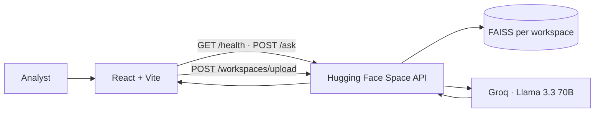

<p align="center">
  
</p>

<h1 align="center">DocMind — RAG Workspace Assistant</h1>

<p align="center">
  <strong>React · Vite · TypeScript · Hugging Face Spaces · Groq · FAISS</strong><br />
  <em>Dark-mode document intelligence — isolated PDF workspaces, grounded answers, and live retrieval telemetry.</em>
</p>

<p align="center">
  <a href="https://github.com/sidnei-almeida/rag-document-qa-assistant"><strong>View on GitHub</strong></a>
  &nbsp;·&nbsp;
  <a href="https://huggingface.co/spaces/salmeida/my-rag-chatbot">Backend (HF Space)</a>
  &nbsp;·&nbsp;
  <a href="https://salmeida-my-rag-chatbot.hf.space/health">API Health</a>
</p>

<p align="center">
  
  
  
  
  
  
  
  
</p>

---

## What this is

A **production-grade React dashboard** for multi-document RAG over PDF workspaces. Upload one or more related PDFs, index them into an isolated vector store, and chat with **grounded answers** backed by retrieved chunks and inline source citations.

The UI does **not** run embeddings or LLM inference locally. Every upload, health check, and question flows through the **Hugging Face Space API** (FastAPI + FAISS + Groq) — this repository is the frontend shell and analyst experience.

> **Production API:** `https://salmeida-my-rag-chatbot.hf.space` — see [`api/README.md`](./api/README.md) for the full backend contract, storage layout, and local FastAPI setup.

---

## Layout & workflow

Three-column shell optimized for document Q&A sessions:

| Zone | Role |
|------|------|
| **Sidebar** | Brand, PDF upload, workspace list, session profile |
| **Chat** | Thread, composer, suggested prompts, upload empty state |
| **Workspace Intelligence** | Live metrics, retrieval stack, documents, retrieved evidence |



**Typical flow**

1. Splash screen polls `GET /health` until the Space is warm.
2. Upload PDFs → creates an isolated **workspace** with its own index.
3. Ask questions → MMR retrieval + LLM answer + citation chips.
4. Right panel shows latency, confidence, stack config, and evidence from the last turn.

---

## Main features

### Workspace management

- **Multi-PDF upload** — one workspace per document group (configurable file limit)
- **Isolated indexes** — each workspace owns its FAISS store; no cross-contamination
- **Status tracking** — `processing` · `ready` · `error` with sidebar indicators
- **Delete workspace / document** — cleanup with confirmation dialogs

### Chat experience

- **Grounded Q&A** — answers constrained to indexed PDF content
- **Citation chips** — page-level evidence linked to retrieved chunks
- **Suggested prompts** — starter questions on empty threads
- **Streaming-style UX** — typing indicator while retrieval + generation run
- **Conversation persistence** — per-workspace message history in local storage

### Workspace Intelligence panel

- **Live metrics** — documents, chunks, last latency (animated count-up), confidence bar
- **Retrieval stack** — vector store, embedding model, LLM provider, MMR settings
- **Document list** — PDF metadata, ready state, delete actions
- **Retrieved evidence** — grouped source rows from the latest assistant turn

### System indicators

- **Boot splash** — diamond logo, staggered dot loader, rotating status copy, 15s timeout + retry
- **Chat header** — API Ready pill, latency badge, health retry, clear conversation
- **Error banners** — upload failures, network errors, with dismissible alerts

---

## RAG pipeline (backend)

Handled entirely on the Hugging Face Space — the frontend only orchestrates:

```
PDF upload → text extraction → chunking → MiniLM embeddings → FAISS index (per workspace)
                                                                    ↓
User question → MMR retrieval (k=6) → context assembly → Groq Llama 3.3 70B → answer + sources
```

| Component | Detail |
|-----------|--------|
| **Vector store** | FAISS — one index per workspace under `storage/documents/{id}/` |
| **Embeddings** | `sentence-transformers/all-MiniLM-L6-v2` |
| **LLM** | `llama-3.3-70b-versatile` via Groq |
| **Retrieval** | MMR (`RETRIEVAL_TYPE=mmr`, `RETRIEVAL_K=6`) |

---

## Design system

Built for long reading sessions: near-black base (`#0A0A0B`), muted typography, and minimal chrome.

| Element | Implementation |
|---------|----------------|
| **Typography** | [Inter](https://fonts.google.com/specimen/Inter) (UI) + [JetBrains Mono](https://www.jetbrains.com/jetbrains-mono/) (IDs, metrics) |
| **Brand mark** | CSS diamond — square rotated 45°, stroke-only, no fill |
| **Surfaces** | Flat panels with `rgba(255,255,255,0.05–0.07)` borders — no card shadows |
| **Chat** | Transparent canvas; user pills right-aligned; assistant column with model avatar |
| **Intelligence panel** | Vertical metric rows, colored stack dots, evidence list with stagger animation |
| **Icons** | [Lucide React](https://lucide.dev) + [Tabler Icons](https://tabler.io/icons) (upload, wifi-off) |

Design tokens live in `src/styles/tokens.css` and component sheets under `src/styles/`.

---

## Tech stack

| Layer | Choice |
|-------|--------|
| Framework | React 19 + Vite 6 |
| Language | JavaScript + TypeScript (API client, hooks, types) |
| Styling | Vanilla CSS — design tokens, no Tailwind |
| Icons | Lucide React · Tabler Icons (webfont) |
| State | React hooks + localStorage session |
| Data | REST via `src/lib/api.ts` → HF Space |
| Deploy | Vercel (static `dist/`) |

---

## Environment

Create `.env.local` from the example:

```env
VITE_API_URL=https://salmeida-my-rag-chatbot.hf.space
VITE_APP_NAME=DocMind
```

| Variable | Description |
|----------|-------------|
| `VITE_API_URL` | Hugging Face Space base URL (no trailing slash). Default in code: `https://salmeida-my-rag-chatbot.hf.space` |
| `VITE_APP_NAME` | Display name shown in UI contexts (default: `DocMind`) |

**Optional — local mock API** (`npm run dev:all`):

```env
VITE_API_URL=/api
VITE_API_PROXY_TARGET=http://localhost:3001
PORT=3001
```

---

## Quick start

```bash
git clone https://github.com/sidnei-almeida/rag-document-qa-assistant.git
cd rag-document-qa-assistant

npm install
cp .env.example .env.local   # HF Space URL is pre-filled

npm run dev
```

Open [http://localhost:5173](http://localhost:5173).

> **Note:** If the HF Space has slept, the splash screen may take up to **15 seconds** to connect. Use **Retry** or wait for the Space to wake — first request after idle can be slow.

### Other scripts

```bash
npm run build          # production bundle → dist/
npm run preview        # serve dist locally
npm run lint           # ESLint on src/
npm run dev:all        # Vite + Node mock API (optional)
npm run generate:favicons   # regenerate PNG favicons from public/favicon.svg
```

---

## Deploy on Vercel

1. Import this repository on [Vercel](https://vercel.com).
2. Framework preset: **Vite**
3. Build command: `vite build` · Output directory: `dist`
4. Environment variables:
   - `VITE_API_URL` = `https://salmeida-my-rag-chatbot.hf.space`
   - `VITE_APP_NAME` = `DocMind`
5. Deploy.

The browser calls the HF Space **directly** — no API proxy required on Vercel. Ensure CORS on the Space allows your deployment origin (the Space is configured with permissive origins for demo use).

---

## Repository structure

```
rag-document-qa-assistant/
├── public/
│   ├── favicon.svg              # Diamond mark (source for PNG favicons)
│   ├── apple-touch-icon.png
│   └── site.webmanifest
├── images/
│   └── novo.png                 # DocMind assistant avatar
├── src/
│   ├── components/
│   │   ├── chat/                # ChatPanel, ChatMessage, UploadHero, composer
│   │   ├── intelligence/        # Metrics, evidence, workspace config
│   │   ├── layout/              # AppShell, Sidebar, RightPanel
│   │   └── ui/                  # ModelAvatar, Badge, Button, …
│   ├── hooks/                   # useApiStatus, useWorkspaces, useChat
│   ├── lib/                     # api.ts, env.ts, types, storage
│   └── styles/                  # tokens, layout, chat, sidebar, right-panel
├── api/                         # FastAPI backend (HF Space source)
├── server/                      # Optional Node mock for local dev
├── scripts/
│   └── generate-favicons.mjs
├── readme_model.md              # README style reference
├── vercel.json                  # Security headers
├── .env.example
└── vite.config.js
```

---

## API surface used by the UI

| Area | Endpoints |
|------|-----------|
| Health | `GET /health` |
| Workspaces | `GET /workspaces`, `GET /workspaces/{id}` |
| Upload | `POST /workspaces/upload` (multipart PDFs) |
| Q&A | `POST /ask` (workspace-scoped question) |
| Cleanup | `DELETE /workspaces/{id}`, document delete, `DELETE /clear` |

Full backend documentation: [`api/README.md`](./api/README.md).

---

## Related components

| Component | Role |
|-----------|------|
| [`api/`](./api/) | FastAPI RAG backend — FAISS, Groq, document registry |
| **HF Space** | Hosted production API at `salmeida-my-rag-chatbot.hf.space` |
| **This repo** | React frontend — workspace UX, chat, intelligence panel |
| [`docmind-chat/`](./docmind-chat/) | Legacy single-page HTML prototype |

---

## Disclaimer

DocMind answers are generated from **user-uploaded PDFs** via retrieval-augmented generation. They are for **research, demonstration, and internal document review only** — not legal, medical, financial, or compliance advice. Always verify claims against the original source documents. Do not upload regulated or confidential data without appropriate enterprise controls.

---

## Author

**Sidnei Alves de Almeida** — [@sidnei-almeida](https://github.com/sidnei-almeida)
